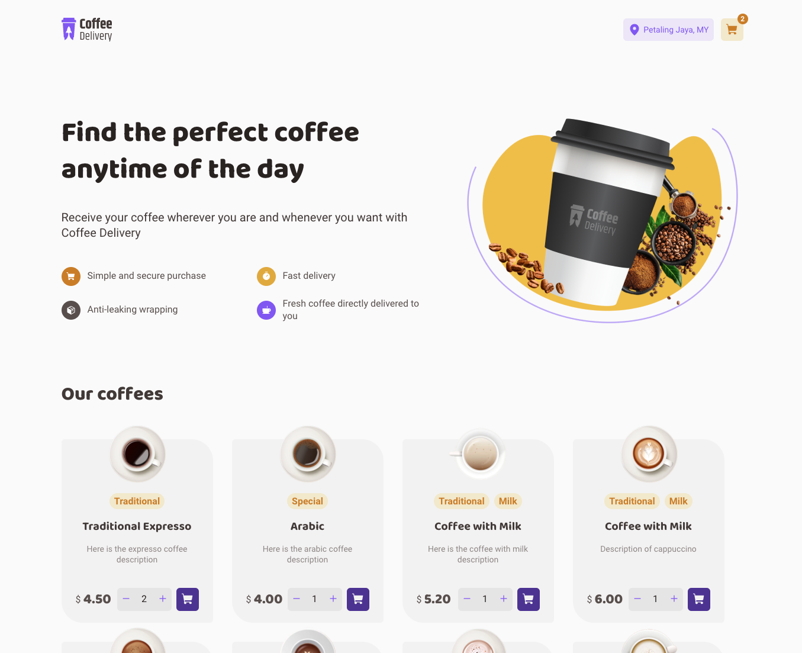
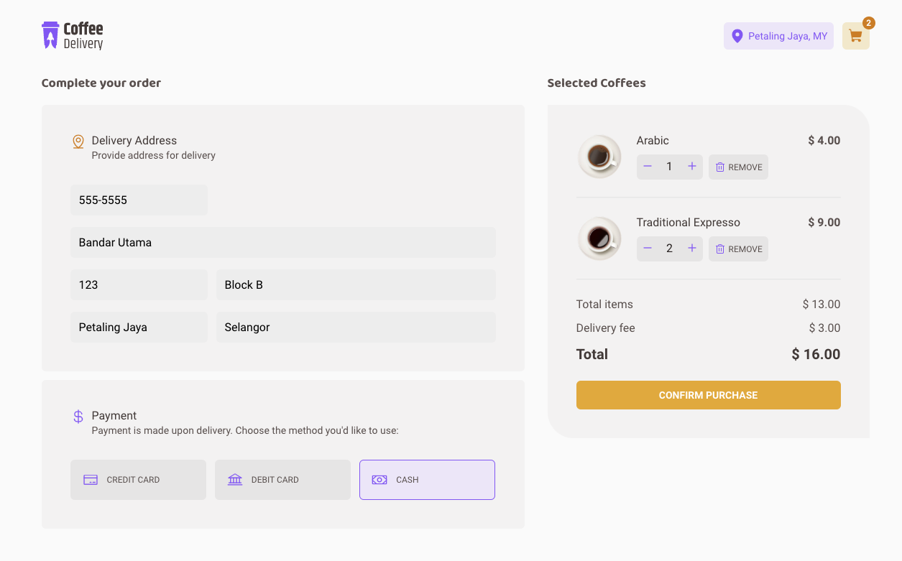
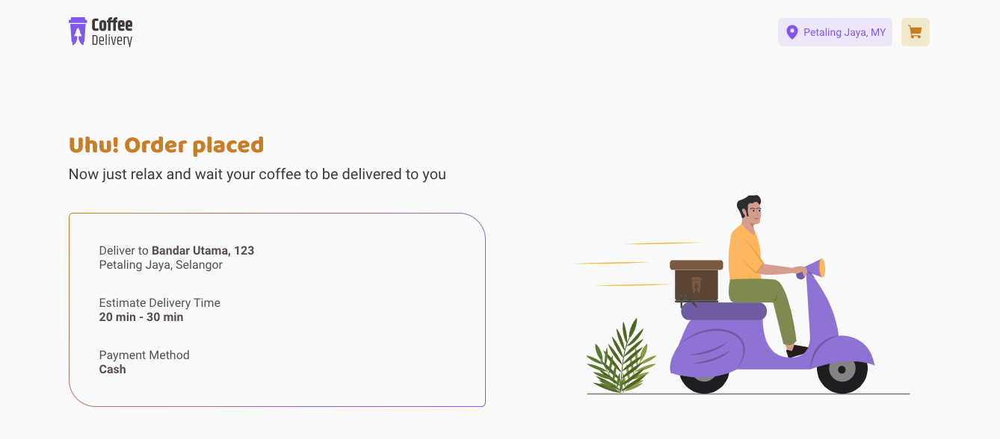

<h1 align="center">Coffee Delivery</h1>

  

## About
React app that allows users to choose different types of coffee to be delivered to him/her. User is able to add/remove coffees to/from shopping cart, choose the payment method and provide the delivery address.

## ✨ Live project
<a href="https://luizpelegrini.github.io/coffee-delivery/" target="_blank">https://luizpelegrini.github.io/coffee-delivery</a>

 

### 🧑‍💻 What I learn
* Navigate between pages using `react-router-dom`
* Share information among pages using React Context API
* Usage of `styled-components` for styling.
* Usage of `react-hook-form` and `zod` for form handling and validation.
* Usage of React reducers to manipulate complex component state

 

---

 

  

    

    

 

---

 

## 🚀 How to run:

- Clone this repository.
- Run `npm install`.
- Run `npm run dev` to start the local server.
